# UTXO-Based Ledger

A simplified ledger implementation using the Unspent Transaction Output (UTXO) model, inspired by Bitcoin's architecture.

## Why UTXO?

The UTXO model is remarkably easy to reason about because it treats money like physical cash: you have discrete "coins" (UTXOs) that you spend entirely and receive change back.

### Mental Model: Cash in Envelopes

Think of each UTXO as cash in an envelope:
- **Deposit**: Someone gives you a new envelope with money
- **Withdrawal**: You open envelopes, take out exactly what you need, and get a new envelope with change
- **Balance**: Count the money in all your unopened envelopes

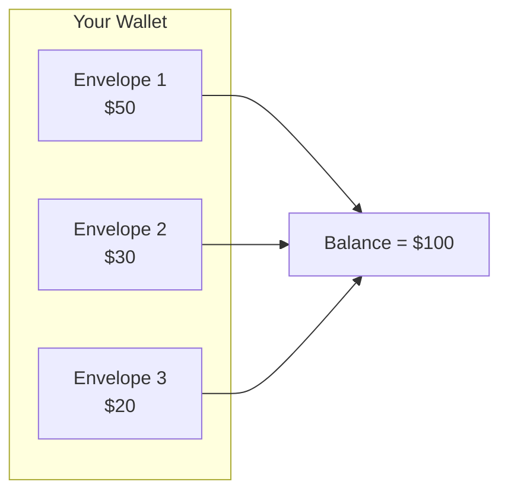

## Core Concepts

### 1. UTXOs Are Immutable

Once created, a UTXO never changes. It can only be:
- **Unspent**: Available for use
- **Spent**: Consumed by a transaction (forever)

This eliminates race conditions: two threads cannot spend the same UTXO because the first one to commit wins, and the second fails.

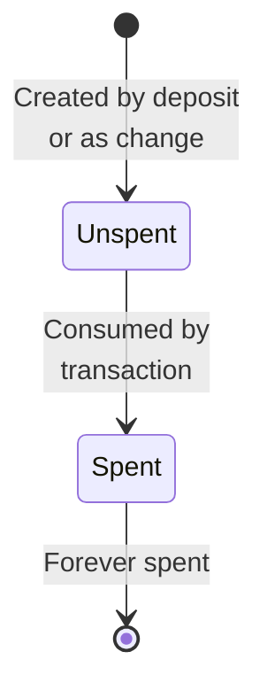

### 2. Transactions Are Balanced

Every transaction must balance: inputs = outputs (except for deposits and withdrawals which create/destroy money).

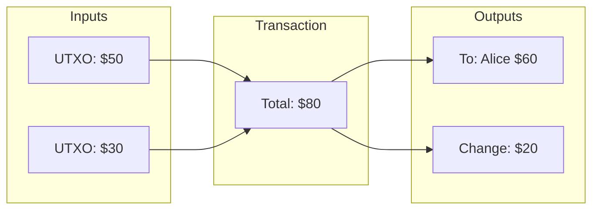

### 3. Sub-Accounts for State Management

Instead of complex state machines, we use sub-accounts to track fund states:

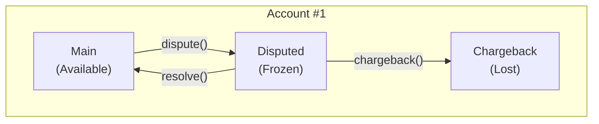

## Operations Explained

### Deposit

Creates money by producing a UTXO with no inputs.

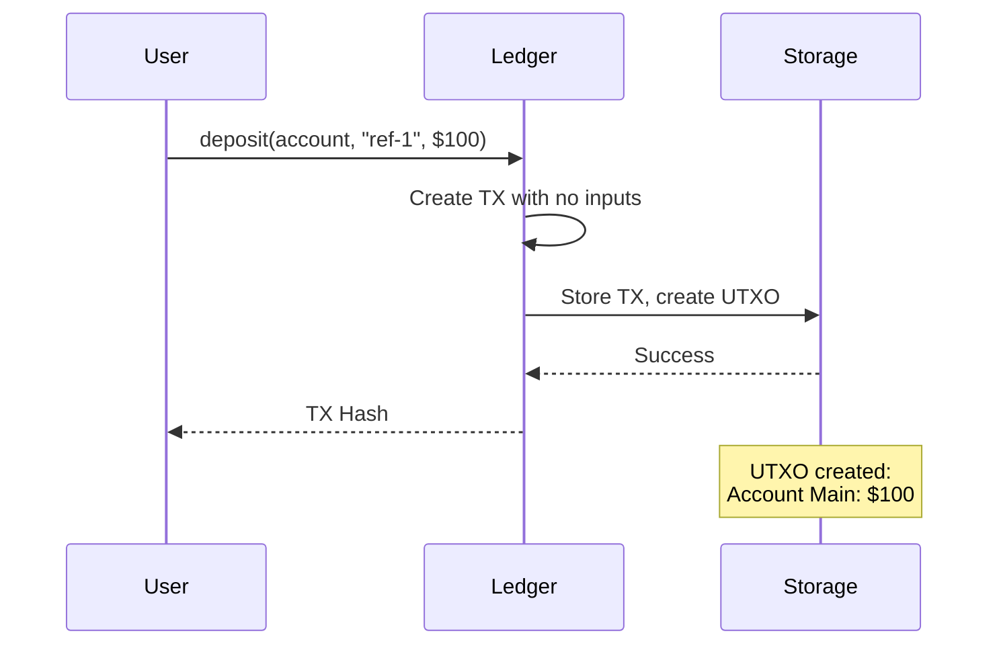

### Withdrawal (Exact Amount)

When you have exactly the right UTXO, it's consumed directly.

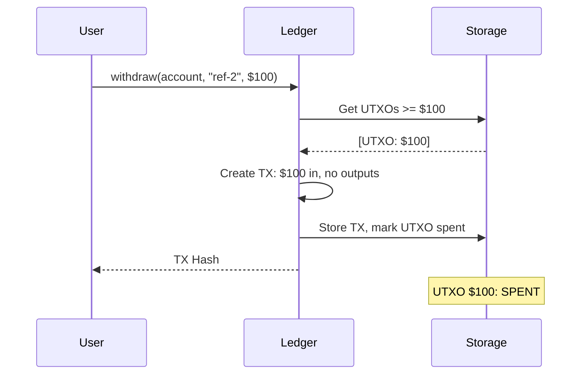

### Withdrawal (With Change)

When UTXOs don't match exactly, an exchange transaction creates change.

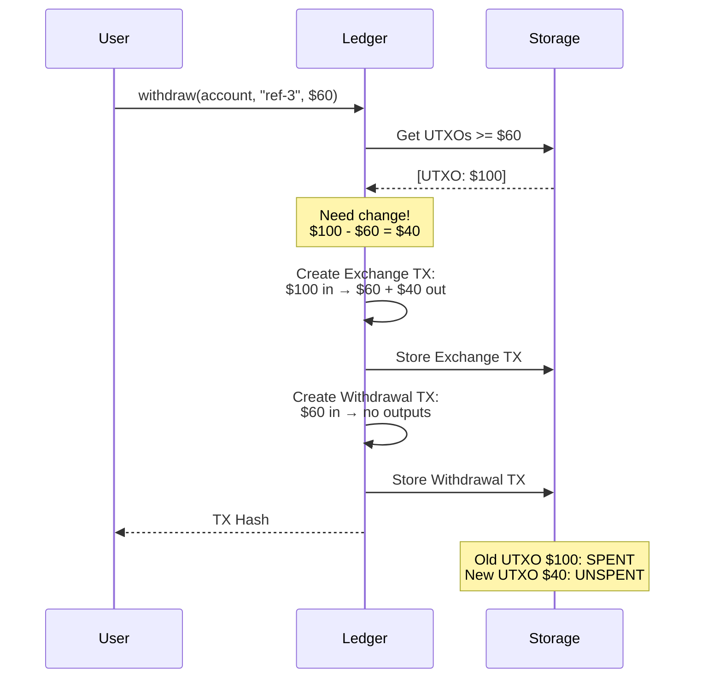

### Dispute Flow

Disputes move funds to a frozen sub-account.

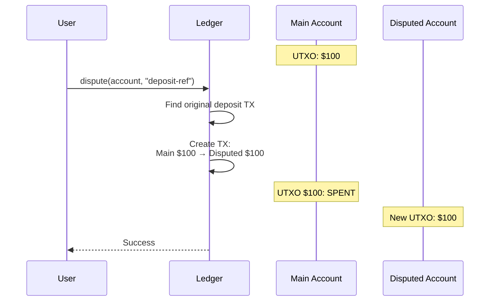

### Resolve vs Chargeback

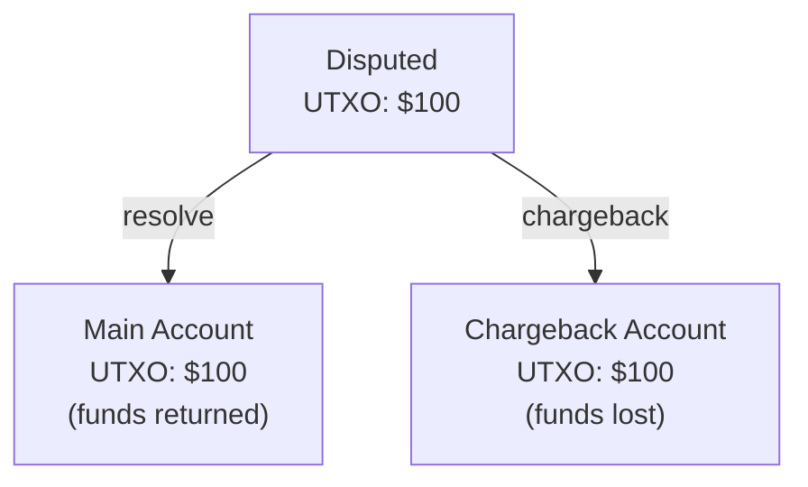

## Why UTXO is Easy to Reason About

### 1. No Hidden State

Balance is always: `sum(unspent UTXOs)`. No need to replay history or trust running totals.

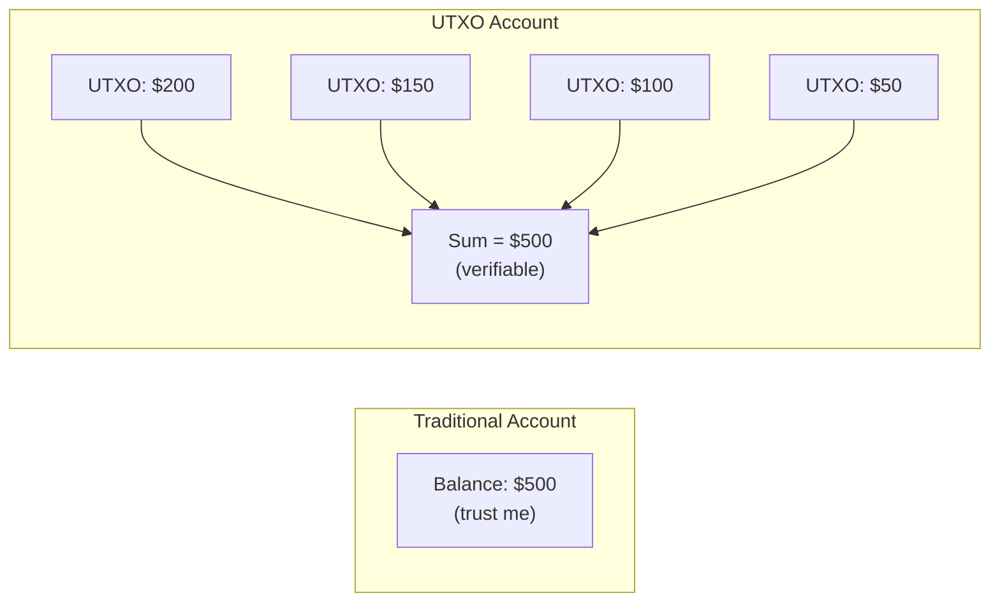

### 2. Natural Concurrency

No locks needed on account balances. Each UTXO is independent.

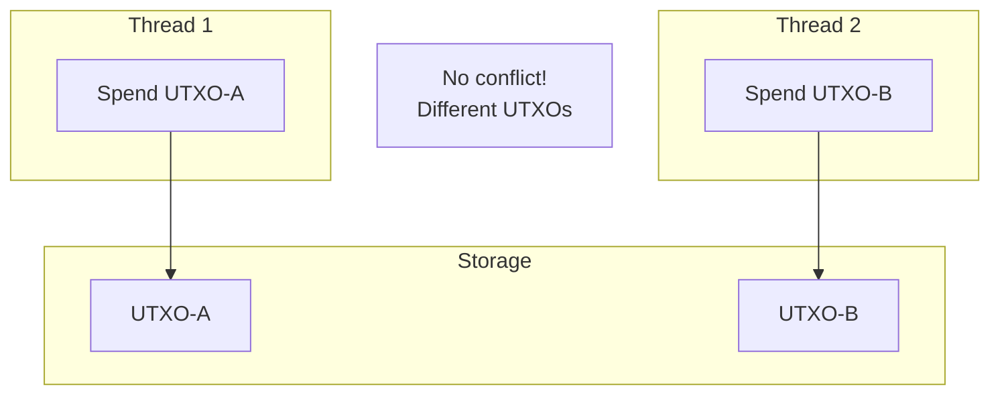

### 3. Atomic Multi-Step Operations

Complex operations are naturally atomic because they consume and produce UTXOs in a single transaction.

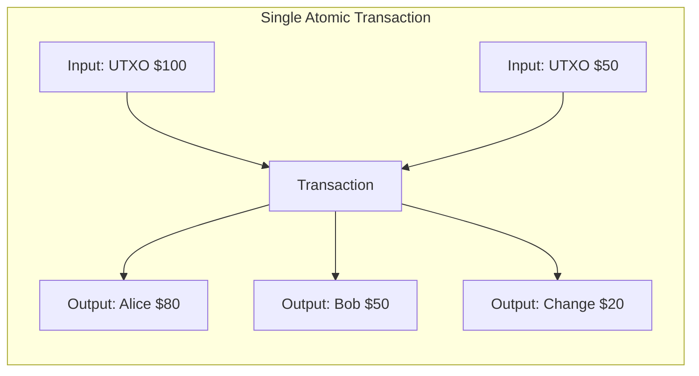

### 4. Complete Audit Trail

Every UTXO traces back to its origin through transaction hashes.

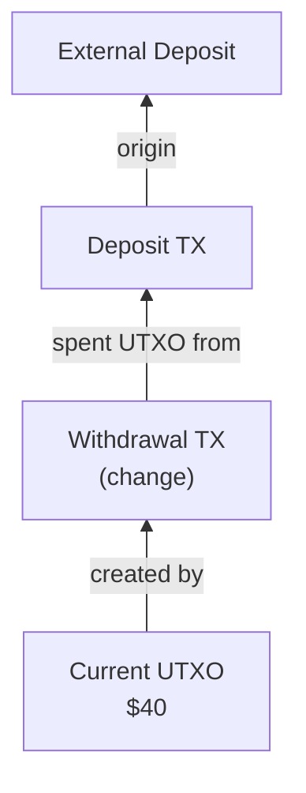

## Architecture Overview

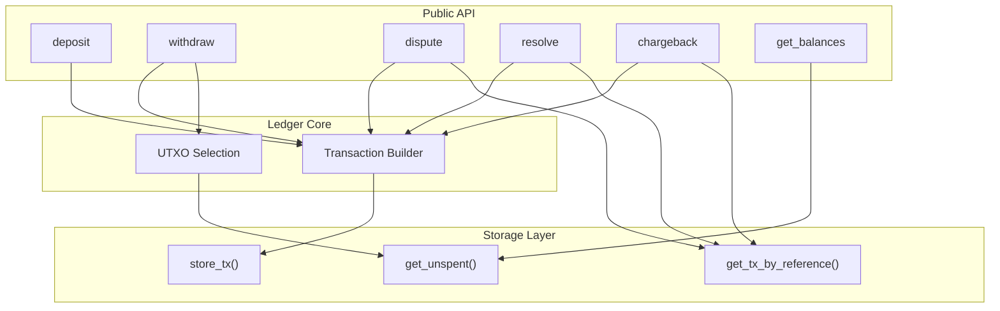

## Summary

The UTXO model trades some storage efficiency for:
- **Simplicity**: Balance = sum of UTXOs
- **Safety**: No double-spending by design
- **Concurrency**: No global locks needed
- **Auditability**: Complete traceable history

It's the same model that secures billions of dollars in Bitcoin, simplified for application-level accounting.
